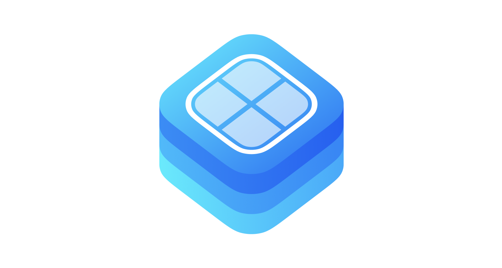

# Generic Cell Presenters

`GenericCellPresenters` is a Swift framework that simplifies dealing with heterogeneous lists of data in a `UITableView` or `UICollectionView`. Its main goal is to reduce boilerplate and to give you a pretty clear approach to control and manipulate with lists of data. 

## Code generation
This approach implemented in our [VIPER architecture templates](https://github.com/Incetro/generamba-templates). All necessary classes and dependencies will be generated automatically.

## Features
- Handles all boilerplate letting you focus on your features.
- Uses generics to adapt to your types. No need to downcast in your code.
- Highly flexible and expandable.
- Unified API for `UITableView` and `UICollectionView`.
- Compiler time checks. Helps you detect mistakes ahead of time.

## How to use

A quick summary would be:

Subclass `GenericCellPresenter` and implement the methods you require (all of them are optional).

```swift
import GenericCellPresenters

// MARK: - MyCellPresenter

final class MyCellPresenter: GenericCellPresenter<MyCell> {
    
    override func configureCell(_ cell: CountryCell) {
        // Your configuration code...
    }

    override func didSelectCell() {
        // Action to execute when the cell is selected...
    }

    override func didDeselectCell() {
        // Action to execute when the cell is unselected...
    }

    override func cellSize(reusableCellHolder: UITableView) -> CGSize {
        /// Calculate size of your cell...
    }
}
```

Register your cell presenters in your `UITableView` or `UICollectionView`.

```swift
MyCellPresenter.registerCell(on: tableView)
OtherCellPresenter.registerCell(on: tableView)
```

Create your list of cell presenters that matches your list of heterogeneous data.

```swift
import GenericCellPresenters

// MARK: - CountriesContentManager

final class CountriesContentManagerImplementation: NSObject, CountriesContentManager {

    // MARK: - Properties

    /// Country controllers factory
    private let controllersFactory: CountryCellControllerFactory

    /// Current controllers which manipulates tableView's cells
    private var controllers: [TableCellController] = []

    /// UITableView with Country cells
    var tableView: UITableView?

    // MARK: - Initializers

    /// Default initializer
    ///
    /// - Parameter controllersFactory: country controllers factory
    init(controllersFactory: CountryCellControllerFactory) {
        self.controllersFactory = controllersFactory
        super.init()
    }

    // MARK: - ContentManager

    func dataSource(for tableView: UITableView) -> UITableViewDataSource {
        self
    }

    func delegate(for tableView: UITableView) -> UITableViewDelegate {
        self
    }

    func updateData(_ viewModels: [CountryCellViewModelProtocol]) {
        guard let tableView = tableView else {
            return
        }
        controllers = controllersFactory.controllers(with: viewModels, tableView: tableView)
        tableView.reloadData()
    }
}

// MARK: - UITableViewDelegate

extension CountriesContentManagerImplementation: UITableViewDelegate {

    func tableView(_ tableView: UITableView, heightForRowAt indexPath: IndexPath) -> CGFloat {
        controllers[indexPath.row].cellSize(reusableCellHolder: tableView).height
    }

    func tableView(_ tableView: UITableView, didSelectRowAt indexPath: IndexPath) {
        let controller = controllers[indexPath.row]
        controller.didSelectCell()
    }

    func tableView(_ tableView: UITableView, didDeselectRowAt indexPath: IndexPath) {
        let controller = controllers[indexPath.row]
        controller.didDeselectCell()
    }
}

// MARK: - UITableViewDataSource

extension CountriesContentManagerImplementation: UITableViewDataSource {

    func tableView(_ tableView: UITableView, numberOfRowsInSection section: Int) -> Int {
        controllers.count
    }

    func tableView(_ tableView: UITableView, cellForRowAt indexPath: IndexPath) -> UITableViewCell {
        let cell = controllers[indexPath.row].cellFromReusableCellHolder(tableView, forIndexPath: indexPath) as? CountryCell
        cell?.selectionStyle = .none
        return cell.unwrap()
    }
}
}
```

For creating your CellPresenters we recommend to use factory protocol and implementation like this:

`CountryCellControllerFactory.swift`

```swift
// MARK: - CountryCellControllerFactory

protocol CountryCellControllerFactory {

    /// Create CountryCellController instance using some
    /// viewModel and register it to the given tableView
    ///
    /// - Parameters:
    ///   - viewModel: viewModel instance for cell's configuration
    ///   - tableView: tableView for registering cell
    /// - Returns: CountryCellController instance
    func controller(with viewModel: CountryCellViewModelProtocol, tableView: UITableView) -> CountryCellController
}

extension CountryCellControllerFactory {

    /// Create CountryCellController array using some
    /// viewModels and register it to the given tableView
    ///
    /// - Parameters:
    ///   - viewModels: viewModels instances for cells configuration
    ///   - tableView: tableView for registering cells
    /// - Returns: CountryCellController array
    func controllers(with viewModels: [CountryCellViewModelProtocol], tableView: UITableView) -> [CountryCellController] {
        viewModels.map {
            controller(with: $0, tableView: tableView)
        }
    }
}
```

`CountryCellControllerFactoryImplementation.swift`

```swift
// MARK: - CountryCellControllerFactoryImplementation

final class CountryCellControllerFactoryImplementation {
    /// Here can be auxiliary properties to iniitialize your CellPresenter in the method below
}

// MARK: - CountryCellControllerFactory

extension CountryCellControllerFactoryImplementation: CountryCellControllerFactory {

    func controller(with viewModel: CountryCellViewModelProtocol, tableView: UITableView) -> CountryCellController {
        CountryCellController.registerCell(on: tableView)
        return CountryCellController(viewModel: viewModel)
    }
}
```

### Important information about `IndexPath`
The `GenericCellPresenter` use the `IndexPath` they are sent while dequeuing cells to be able to locate that cell in other methods, like `currentCell()`. If you insert or delete cells in your `UITableView` or `UICollectionView` without reloading it, remember to manually update the `IndexPath` of the Cell Presenters that may be affected.

## How to install
### CocoaPods
1. Make sure `use_frameworks!` is added to your `Podfile`.
2. Include the following in your `Podfile`:
```
pod 'incetro-generic-cell-presenters'
```
3. Run `pod install`.

### Carthage
Simply add `GenericCellPresenters` to your **Cartfile**: `github "Incetro/generic-cell-presenters"`

### Manually
1. Clone, add as a submodule or [download](https://github.com/Incetro/generic-cell-presenters/archive/master.zip).
2. Drag and drop `GenericCellPresenters` project to your workspace.
3. Add `GenericCellPresenters` to Embedded binaries.
4. 
## License
Source code is distributed under MIT license.
